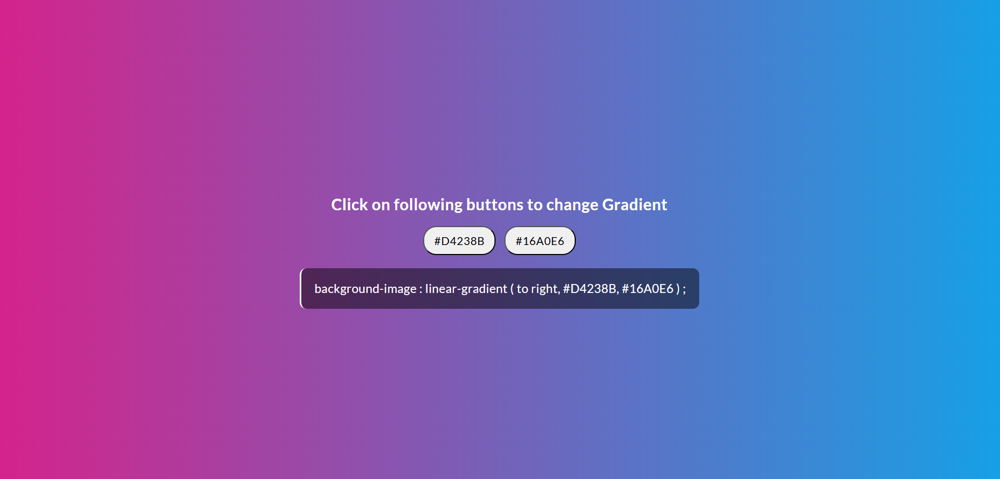

# 🎨 Random Color Generator

A simple Random Color Generator built using **HTML, CSS, and JavaScript**.  
This app generates a random color on each click and displays its HEX code.  
Users can easily **select the color code text** and copy it manually.

---

## ✨ Features
- 🎨 Generates a new random color on each click  
- 🔢 Displays the HEX color code  
- 🖱️ Easy manual copy by selecting the text  
- ⚡ Lightweight and responsive design  

---

## 🚀 Live Demo
[[Click here to try the app](https://our-deepak.github.io/Random-Gradient-Generator/)] 

---

## 📸 Preview

---

## 💻 How to Use
1. Clone the repository
2. Just open the `index.html` file in your browser
